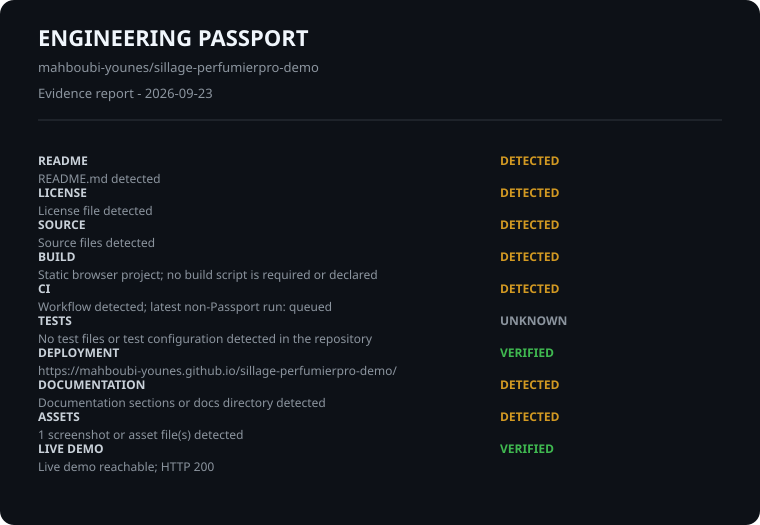

# Engineering Passport

Repository: mahboubi-younes/sillage-perfumierpro-demo

Evidence-first report. This is not a quality score or ranking.

## Evidence

- **README** | DETECTED | README.md detected
- **LICENSE** | DETECTED | License file detected
- **SOURCE** | DETECTED | Source files detected
- **BUILD** | UNKNOWN | Not detected
- **CI** | DETECTED | Workflow run found; latest conclusion: in_progress
- **TESTS** | UNKNOWN | Test files and configurations not detected
- **DEPLOYMENT** | VERIFIED | https://mahboubi-younes.github.io/sillage-perfumierpro-demo/
- **DOCUMENTATION** | DETECTED | Documentation sections or docs directory detected
- **ASSETS** | DETECTED | 1 screenshot or asset file(s) detected
- **LIVE DEMO** | DETECTED | URL declared in README: https://mahboubi-younes.github.io/sillage-perfumierpro-demo/

## Technologies

JavaScript

## Verification context

- Generated: 2026-09-23T11:04:10.962Z
- GitHub API: Repository metadata read from GitHub API

Unknown means evidence was unavailable; no claim is made.
